### 创建开发机并进行SSH连接

#### 创建开发机

首先进入[InternStudio](https://aicarrier.feishu.cn/wiki/QtJnweAW1iFl8LkoMKGcsUS9nld#share-LeUxdm8Z0opL8exaZwGcNet7n2J)官网，登录账号后找到创建开发机的位置

填写开发机名称和选择开发机镜像（镜像可以理解为软件的运行环境，InternStudio将运行环境打包成一个镜像，不需要手动一个一个配置运行，方便我们进行后期开发）

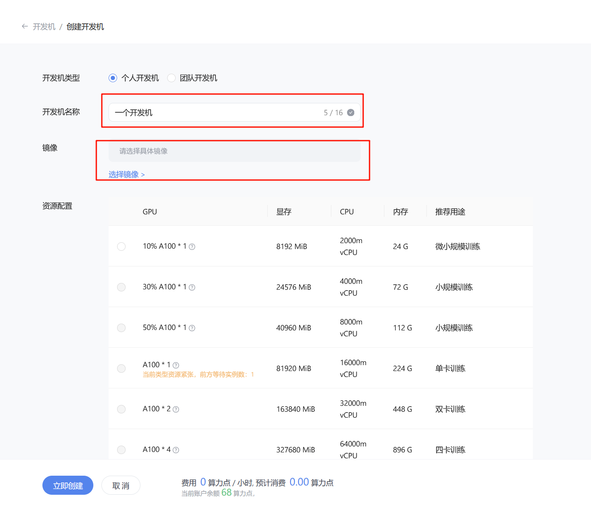

这里镜像选择比较新的cuda版本的镜像

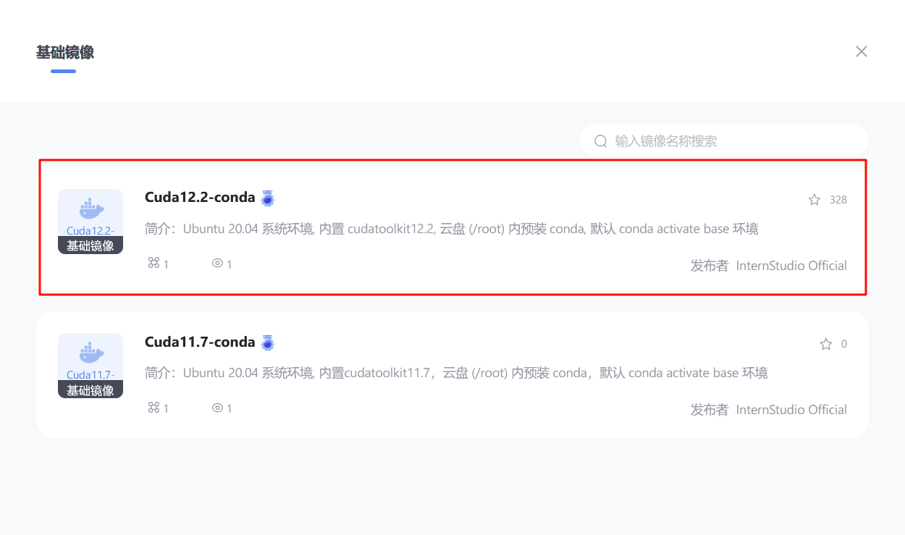

第一个作业不需要很强的GPU算力，选择第一个10% A100就可以了

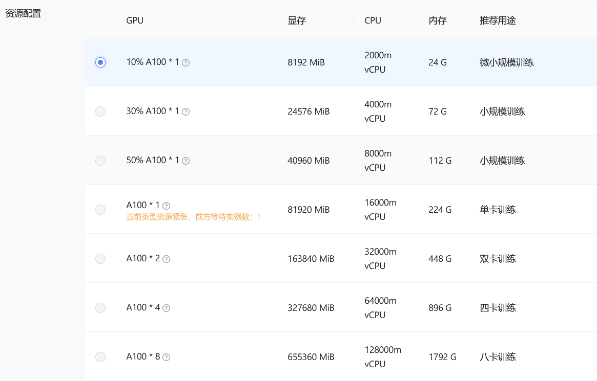

选择预计开发机运行时间，第一个作业一般半小时就可以足够，如果觉得时间不够的话可以自行调整

有时候可能需要排队，稍微等一下

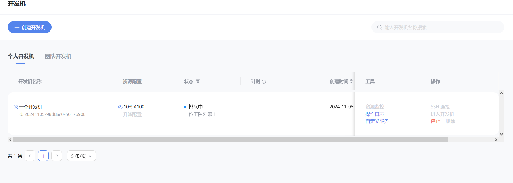

#### 使用 vscode 进行SSH连接

vscode 是一个非常方便好用的集成开发软件，我们使用它进行SSH连接远程开发机

当成功分配开发机资源之后，可以点击右边的SSH连接，SSH是一种安全的连接方式，通过这种协议连接远程的开发机（服务器）

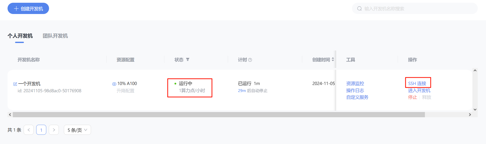

**添加公钥**的作用是，方便以后再次连接服务器的时候不用输入密码，添加公钥之后，服务器就记住了你的电脑连接过服务器，下次再连接服务器就不需要输入密码了。如果是第一次连接服务器，一般还是需要先输入账号和密码的。

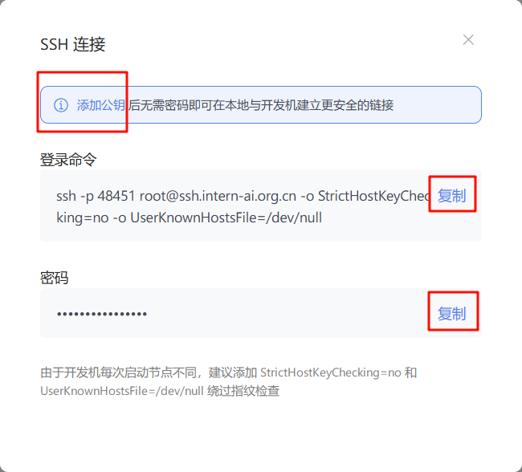

打开 vscode，并安装好 **SSH-remote 插件**，按照提示点击左边栏上的插件按钮，然后点击➕号新建一个连接，把刚才复制的**登录命令**和**密码**依次输入进 vscode上方弹出的窗口中

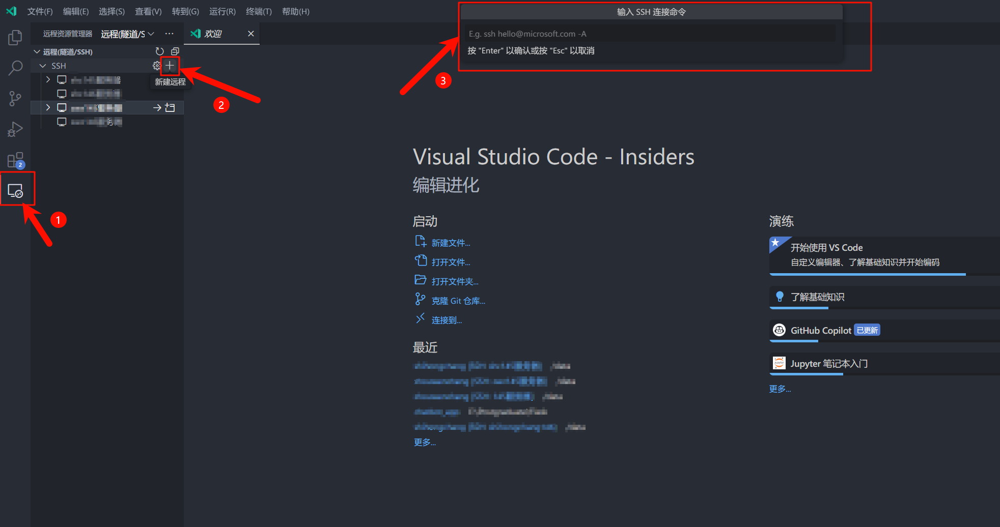

输入**登录命令**之后，右下角会弹出连接的提示

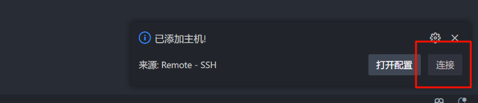

之后会弹出一个新窗口，上方提示需要输入**密码**

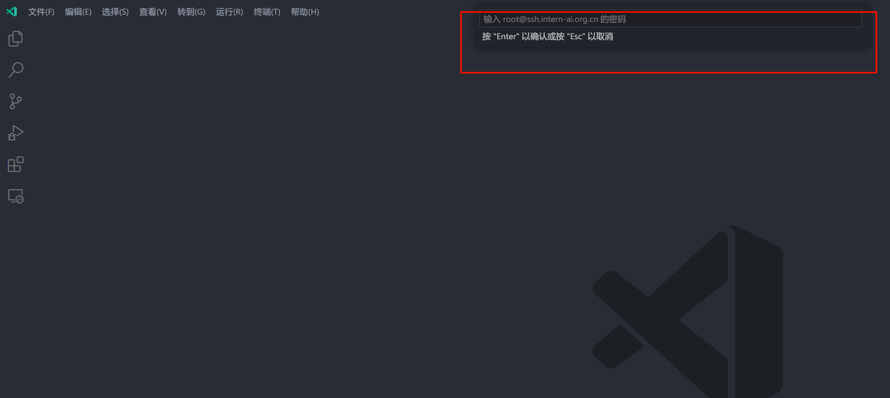

右下角提示正在安装 vscode 服务器，稍微等一下

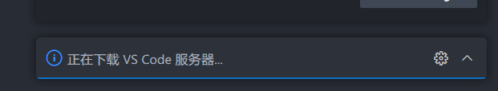

左下角有这个SSH文字提示说明连接成功了

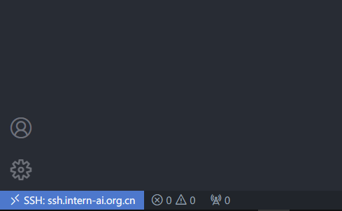

### 进行端口映射和运行hello_world.py

按图示点击就可以打开开发机的终端

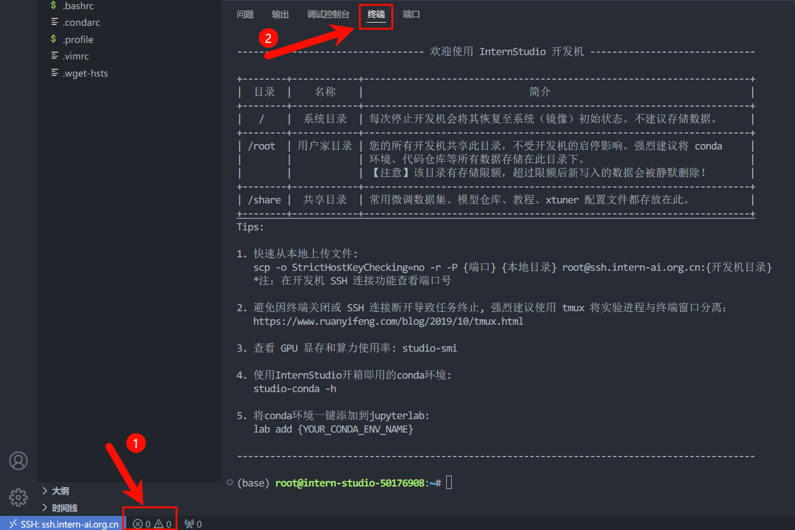

创建 hello_world.py文件

运行 hello_world.py文件

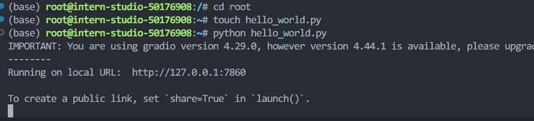

vscode 自动进行了端口映射，打开浏览器可以看到开发机运行的 hello_world.py 程序的输出

端口转发

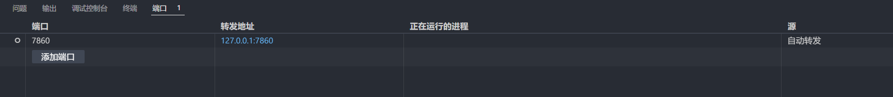

也可以手动改变映射到本地端口的地址

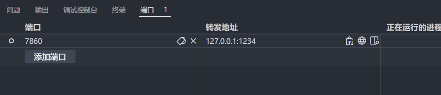

### Linux 基础命令

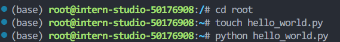

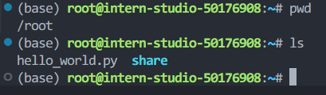
