### 创建开发机并进行SSH连接

#### 创建开发机

首先进入[InternStudio](https://aicarrier.feishu.cn/wiki/QtJnweAW1iFl8LkoMKGcsUS9nld#share-LeUxdm8Z0opL8exaZwGcNet7n2J)官网，登录账号后找到创建开发机的位置

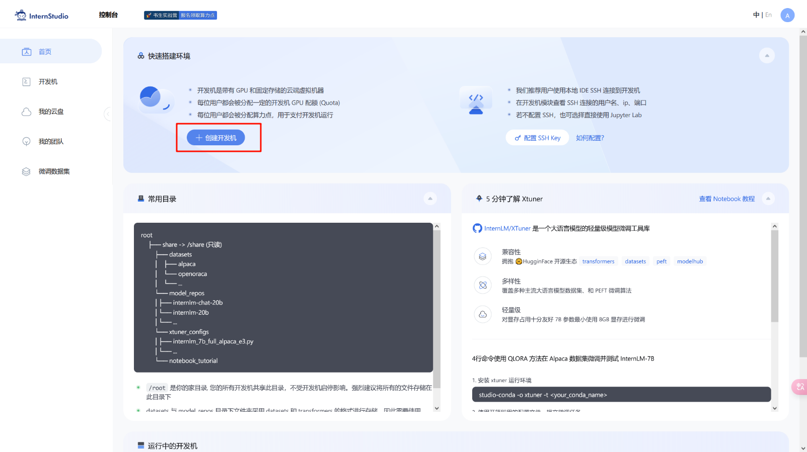

填写开发机名称和选择开发机镜像（镜像可以理解为软件的运行环境，InternStudio将运行环境打包成一个镜像，不需要手动一个一个配置运行，方便我们进行后期开发）


这里镜像选择比较新的cuda版本的镜像


第一个作业不需要很强的GPU算力，选择第一个10% A100就可以了

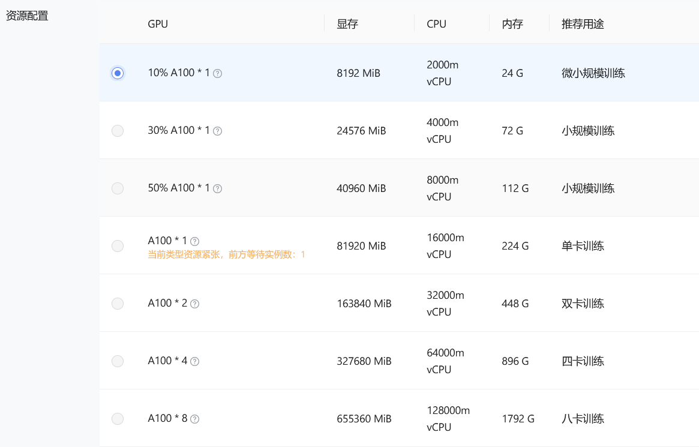

选择预计开发机运行时间，第一个作业一般半小时就可以足够，如果觉得时间不够的话可以自行调整


有时候可能需要排队，稍微等一下

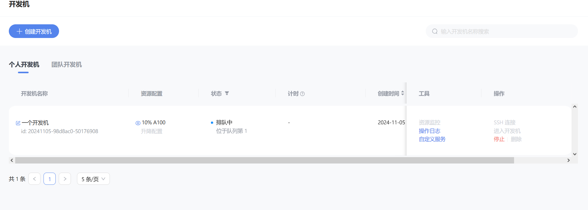

#### 使用 vscode 进行SSH连接

vscode 是一个非常方便好用的集成开发软件，我们使用它进行SSH连接远程开发机

当成功分配开发机资源之后，可以点击右边的SSH连接，SSH是一种安全的连接方式，通过这种协议连接远程的开发机（服务器）


**添加公钥**的作用是，方便以后再次连接服务器的时候不用输入密码，添加公钥之后，服务器就记住了你的电脑连接过服务器，下次再连接服务器就不需要输入密码了。如果是第一次连接服务器，一般还是需要先输入账号和密码的。

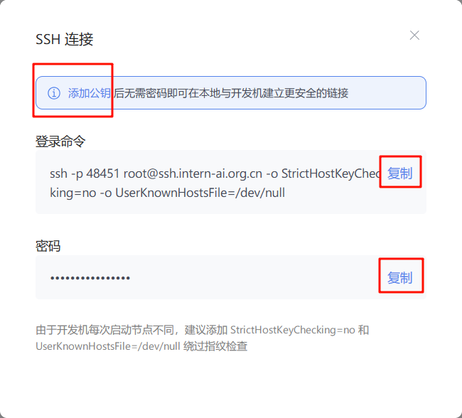

打开 vscode，并安装好 **SSH-remote 插件**，按照提示点击左边栏上的插件按钮，然后点击➕号新建一个连接，把刚才复制的**登录命令**和**密码**依次输入进 vscode上方弹出的窗口中


输入**登录命令**之后，右下角会弹出连接的提示


之后会弹出一个新窗口，上方提示需要输入**密码**

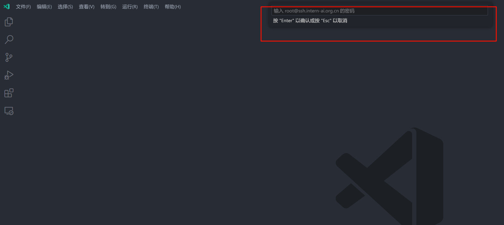

右下角提示正在安装 vscode 服务器，稍微等一下

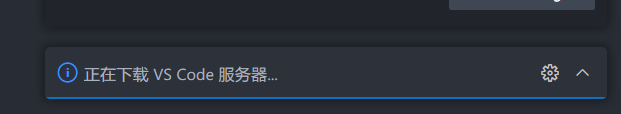

左下角有这个SSH文字提示说明连接成功了

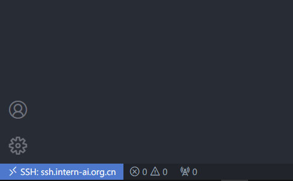

### 进行端口映射和运行hello_world.py

按图示点击就可以打开开发机的终端

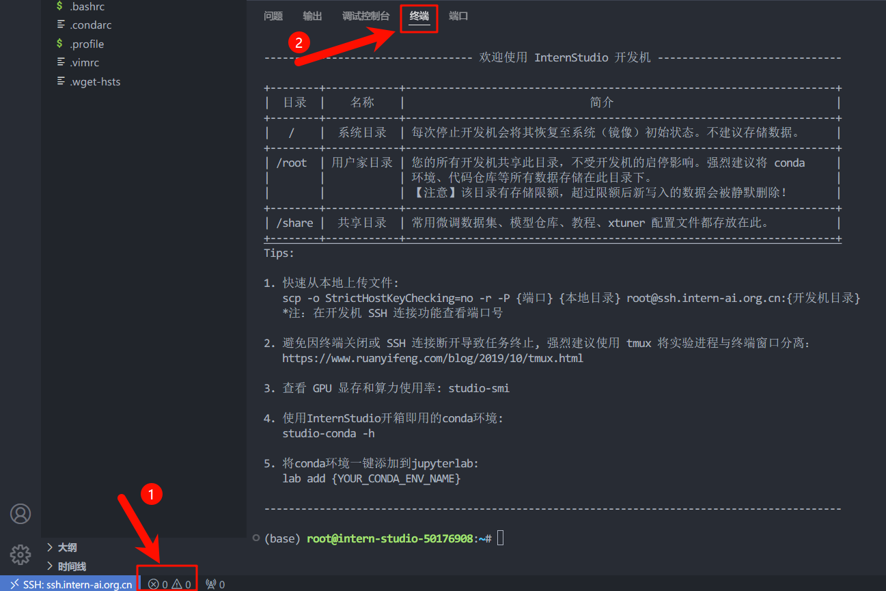

创建 hello_world.py文件

运行 hello_world.py文件

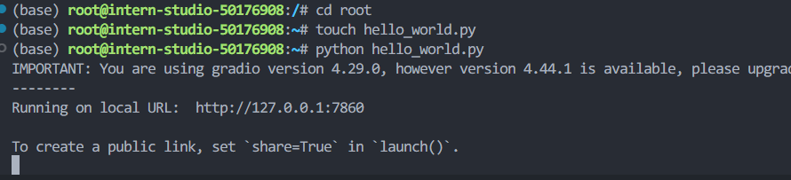

vscode 自动进行了端口映射，打开浏览器可以看到开发机运行的 hello_world.py 程序的输出


端口转发

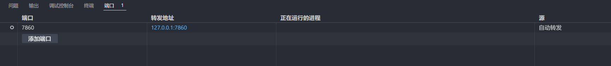

也可以手动改变映射到本地端口的地址

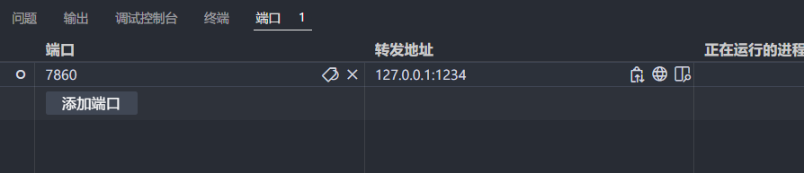

### Linux 基础命令


## L0G2000

#### Leetcode 383

##### 代码

```python
class Solution:
    def canConstruct(self, ransomNote: str, magazine: str) -> bool:
        def count_letters(s):
            count_dict = {}
            for letter in s:
                if letter in count_dict:
                    count_dict[letter] += 1
                else:
                    count_dict[letter] = 1
            return count_dict

        def compare_counts(a, b):
            for key in a:
                if key not in b or a[key] > b[key]:
                    return False
            return True
        # 计算每个字母的出现次数
        dict_a = count_letters(ransomNote)
        dict_b = count_letters(magazine)

        # 比较两个字典中字母出现的次数
        result = compare_counts(dict_a, dict_b)
        return(result)
```


##### 通过截图


#### debug

下图是查看debug信息


查看res的值：

```
res='根据提供的模型介绍文字，以下是提取的关于该模型的信息，以JSON格式返回：\n\n```json\n{\n  "模型名字": "书生浦语InternLM2.5",\n  "开发机构": "上海人工智能实验室",\n  "提供参数版本": "1.8B、7B和20B",\n  "上下文长度": "1M"\n}\n```\n\n这个JSON对象包含了模型名字、开发机构、提供参数版本以及上下文长度这四个关键信息。'
```

发现输出的信息不止包括json信息，估需要修改提示词，让模型只输出json信息，不输出多余的描述

修改提示词之后输出的res值：

```
'```json\n{\n  "model_name": "书生浦语InternLM2.5",\n  "development_institution": "上海人工智能实验室",\n  "parameter_versions": ["1.8B", "7B", "20B"],\n  "context_length": "1M"\n}\n```'
```

还是不行，模型会输出多余的头和尾，仅通过修改提示词的方式无法完全解决

故使用字符串表达式删除输出信息中多余的 \```json\n 和 \n```

```
res = res.replace('```json\n', '', 1).rstrip('\n```')
```


通过上述方法解决bug


## L0G4000

### 模型下载

使用Hugging Face平台下载模型

仅下载 config.json 文件、model.safetensors.index.json 文件

打开[Github CodeSpace](https://github.com/codespaces)


选择进入网页版vscode界面，在下方终端中安装依赖库


创建下载模型的配置文件，并保存，然后运行，可以看到已经从 hugging face 下载了相应的 json 文件到 codespace 中了


### 模型上传

首先在codespace终端里运行安装git lfs的命令


去[hugging face](https://huggingface.co/settings/tokens)创建access tokens


然后使用token登录到 hugging face


创建一个hugging face项目，命名为intern_study_L0_4，然后克隆到本地，接下来上传config.json文件和README.md文件到克隆的文件夹中，最后用git提交到hugging face远程仓库


可以在Hugging Face的个人profile里面看到这个model，至此模型上传成功


### Space上传

打开hugging face的spaces网页，创建一个新的space


将space克隆到本地，然后修改文件夹中的index.html文件，然后提交push到远程仓库上，space会自动更新页面


至此space上传成功


## L1G1000

本次课程深入介绍了书生·浦语（Informer）大模型的开源开放体系及其发展历程。 

- **技术亮点**：涵盖从数据采集、模型训练到实际应用场景的全流程解决方案，并实现了显著性能提升及创新功能突破。例如，最新版Informer LM 2.5拥有卓越的推理能力和长达百万级别的上下文容量，在某些指标上甚至超过同类开源模型。 
- **核心优势**：强调高性能模型的全面覆盖，从小规模至大规模均适用；同时推出了一系列配套工具，诸如高效的微调框架、自动标签系统Label LLM等，极大简化开发者的工作流。
- **应用前景**：不仅限于基础研究领域，还积极拓展到了具体业务场景的应用探索，特别是Mind Search智能搜索平台展示了利用大型语言模型进行复杂查询的独特潜力。
-  **社区建设**：重点阐述了围绕Informer LM建立的庞大生态系统，涵盖了丰富的数据资源、多样化的培训框架和详尽的测试标准，确保每个参与者都能从中受益并贡献自身力量。 

